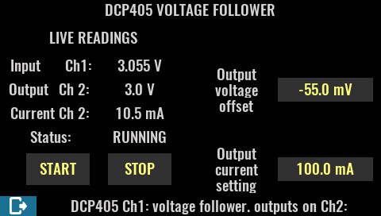

# EEZ BB3 DCP405 voltage follower
Voltage follower script for EEZ BB3 programmable Power supply.

This is my second Testproject with claude code. I understand how programming works in general, i can understand some code and do small changes but i'm not a real programmer. 

Recently i saw a YT video about vibe coding and gave claude code a try with a small project. 

The DCP405_voltage_follower.py works on a EEZ BB3 PSU with 2 mounted DCP405 Modules (Slot1 and Slot2).
Channel 1 output is always disabled. The script reads the voltage from this channel.
Channel 2 can set to enabled and will output the same voltage it reads on Channel 1 by default at 100mA.
The Output voltage and current can be adjusted. 

The complete .py script and .eez-project file was created by claude. Of course, several iterations were needed. But i'm flashed how well claude code works.
For example, when the script was nearly finished i noticed OVP kicked in and disabled Ch2: output. Status displayed still "RUNNING" but the output voltage was incorrect because of the disabled Ch2:. I let claude take a screenshot from BB3 by expressing the IP and i also let him take a screenshot from my connected Keithley DMM6500 and compare the images. Claude automaticly found the fault with missing voltage and fixed it by itself. When i asked claude the first time to take a screenshot from BB3, he tried different ways of how to grab a screenshot. Once he found the correct way, he wrote it to a separate .py file. 
